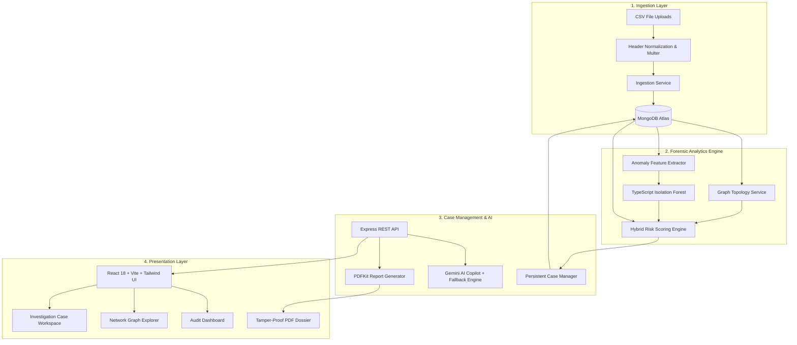

# FinTrace AI

> **Explainable Financial Micro-Auditing for High-Stakes Disbursements**

FinTrace AI is an automated forensic auditing and financial micro-audit platform designed for welfare disbursements, public grant programs, and enterprise payout streams. It ingests complex transaction datasets, runs hybrid risk analysis combining rule-based heuristics with TypeScript-native Isolation Forest anomaly detection, models topological entity relationships, and provides explainable evidence dossiers for human investigators.

[Live Demo](https://fintrace-ai.vercel.app) &nbsp;|&nbsp; [Source Code](https://github.com/theafzalansari/fintrace-ai)

---

> **Responsible-Use Disclaimer**: Risk scores and anomaly flags generated by FinTrace AI are mathematical decision-support signals designed to assist human investigators. They do not constitute legal proof of fraud or financial wrongdoing. Certified human audit sign-off is required before taking regulatory or enforcement actions.

---

## 📌 Problem & Solution

### The Challenge
- **Audit Scale**: High-volume disbursement programs process thousands of payments, making manual forensic inspection cost-prohibitive and slow.
- **Hidden Rings**: Fraudulent actors split disbursements across multiple shell entities, synthetic identities, and shared payout bank accounts.
- **Black-Box AI**: Standard machine learning models produce isolated risk scores without explainable evidence, leaving compliance officers without actionable context for regulatory filing.

### The FinTrace AI Solution
FinTrace AI unifies data ingestion, dual-engine risk analysis, entity topology, and human-in-the-loop case management into a single, explainable workspace:
1. **Schema-Agnostic Ingestion**: Ingests beneficiary and disbursement records with flexible header normalization and validation.
2. **Dual-Engine Risk Scoring**: Combines deterministic statutory compliance rules with unsupervised Isolation Forest ML anomaly scoring.
3. **Graph Topology Analysis**: Maps bipartite relationships across disbursing accounts, routing intermediaries, and recipient IBANs to expose shared identity attributes and account collisions.
4. **Human-in-the-Loop Workflow**: Converts findings into persistent investigation cases, enabling auditors to annotate evidence, update review statuses, and export tamper-proof PDF audit dossiers.

---

## 🚀 Key Features

| Feature | Description | Implementation Status |
| :--- | :--- | :--- |
| **CSV Ingestion Engine** | Streamlined upload for beneficiaries and disbursements with header alias normalization and schema validation. | Implemented |
| **Audit Dashboard** | High-level overview of total volume, flagged risk distribution, high-priority clusters, and recent disbursement ledger. | Implemented |
| **Hybrid Risk Scoring** | Deterministic rule checking combined with machine learning anomaly detection for composite risk prioritization. | Implemented |
| **Isolation Forest Anomaly Detection** | In-house TypeScript implementation of Isolation Forest tree ensembles for zero-day pattern detection. | Implemented |
| **Entity Topology Graph** | Interactive network graph connecting beneficiaries, shared payout accounts, and disbursement edges. | Implemented |
| **Persistent Case Management** | Multi-status case lifecycle tracking (`PENDING_REVIEW`, `IN_REVIEW`, `VERIFIED_CLEAN`, `CONFIRMED_RISK`) backed by MongoDB Atlas. | Implemented |
| **AI Audit Copilot** | Conversational forensic assistant powered by `@google/genai` (Gemini) with a deterministic fallback engine when offline. | Implemented |
| **Forensic Dossier Export** | Dynamic PDF audit report generation (using `pdfkit`) and CSV findings export for regulatory filing. | Implemented |
| **Dark & Light Mode** | Responsive theme engine built with Tailwind CSS. | Implemented |

---

## ⚙️ How the Risk Engine Works

FinTrace AI evaluates risk using a three-tier analysis framework to maximize detection coverage while providing clear audit trails.

```
                           +--------------------------------+
                           |  Raw Disbursement & Ben Data   |
                           +---------------+----------------+
                                           |
                    +----------------------+----------------------+
                    |                                             |
     +--------------v---------------+              +--------------v---------------+
     |  Rule-Based Heuristics       |              |  TypeScript Isolation Forest |
     |  - Shared Payout Accounts    |              |  - 40 Trees / 64 Subsamples  |
     |  - Shared Identity Hashes    |              |  - High-Dimensional Vector  |
     |  - High Velocity / Volume    |              |  - Feature Contribution      |
     +--------------+---------------+              +--------------+---------------+
                    |                                             |
                    | Raw Rule Score (0-100)                      | Anomaly Score (0.00 - 1.00)
                    +----------------------+----------------------+
                                           |
                                    +------v-------+
                                    | Hybrid Score |
                                    +------+-------+
                                           |
                                           v
                             [0-29: LOW | 30-69: MEDIUM | 70-100: HIGH]
```

### 1. Deterministic Rule-Based Analysis (Engine A)
Evaluates statutory and operational compliance triggers:
- **Shared Payout Accounts**: Multiple beneficiaries routing funds into identical bank accounts.
- **Identity & Contact Collisions**: Shared phone numbers, email addresses, physical addresses, or identity hashes.
- **Volume & Velocity Anomalies**: Cumulative disbursements exceeding ₹500,000 or high transaction frequency.
- **Payment Failures**: History containing failed or reversed disbursement attempts.

### 2. Isolation Forest Anomaly Scoring (Engine B)
An unsupervised tree-ensemble model implemented directly in TypeScript (`IsolationForest(40, 64)`):
- Extracts multi-dimensional feature vectors per beneficiary (payment velocity, total volume, shared attribute degrees, failed transaction ratios).
- Isolates statistical outliers without requiring prior labeled fraud data.
- Generates a normalized anomaly score from `0.00` to `1.00`.

### 3. Hybrid Composite Risk Score Formula
The overall risk score is calculated as a weighted composite of both engines:

$$\text{Hybrid Risk Score} = \min\left(100, \max\left(0, \text{round}(0.65 \times \text{Rule Score} + 0.35 \times (\text{Anomaly Score} \times 100))\right)\right)$$

### Risk Categorization
- **HIGH RISK** ($\ge 70$): Immediate priority; lock account and flag for mandatory forensic audit.
- **MEDIUM RISK** ($30 - 69$): Secondary priority; flag for routine compliance sampling.
- **LOW RISK** ($< 30$): Standard clearance; routine disbursement processing.

---

## 🏗️ Architecture



### Verified Technology Stack

- **Frontend**: React 18, Vite 6, TypeScript 5, Tailwind CSS 3, Lucide React, Clerk React (`@clerk/clerk-react`).
- **Backend**: Node.js, Express 4, TypeScript 5, MongoDB Atlas, Mongoose 8, Multer, `csv-parse`, `pdfkit`, Zod.
- **Machine Learning**: Custom TypeScript-native `IsolationForest` implementation.
- **AI Integration**: Google Gemini SDK (`@google/genai`) with fallback handling.

---

## 🖼️ Interface & Visual Tour

<!-- Note: Add repository-relative screenshots here to showcase your live interface -->

| Interface Component | Preview |
| :--- | :--- |
| **Landing Page** | Continuous network node backdrop with sticky header and comprehensive feature breakdown. |
| **Audit Dashboard** | High-level metrics, risk score distributions, and prioritized evidence ledgers. |
| **Network Graph Explorer** | Interactive bipartite entity topology connecting beneficiaries and payout gateways. |
| **AI Audit Copilot** | Context-aware forensic assistant analyzing live dataset records. |

*(To populate actual screenshot previews, store images under `frontend/public/images/` and update link references above.)*

---

## 💻 Local Development Setup

### Prerequisites
- **Node.js**: `v18.0.0` or higher
- **npm**: `v9.0.0` or higher
- **MongoDB**: A running local MongoDB instance or a free MongoDB Atlas cluster connection URI.

### 1. Clone the Repository
```bash
git clone https://github.com/theafzalansari/fintrace-ai.git
cd fintrace-ai
```

### 2. Install Dependencies
Install dependencies for both frontend and backend packages:
```bash
# Root monorepo dependencies
npm install

# Sub-workspace dependencies
npm install --prefix backend
npm install --prefix frontend
```

### 3. Configure Environment Variables

Copy the example environment configurations:
```bash
cp backend/.env.example backend/.env
cp frontend/.env.example frontend/.env
```

**`backend/.env`**:
```env
PORT=5000
NODE_ENV=development
MONGODB_URI=mongodb://localhost:27017/fintrace-ai
CORS_ORIGIN=http://localhost:5173
GEMINI_API_KEY=your_gemini_api_key_here
GEMINI_MODEL=gemini-3.5-flash
```

**`frontend/.env`**:
```env
VITE_API_BASE_URL=http://localhost:5000/api
VITE_CLERK_PUBLISHABLE_KEY=pk_test_sample_key
```

### 4. Start Development Servers
Run both backend (`http://localhost:5000`) and frontend (`http://localhost:5173`) concurrently:
```bash
npm run dev
```

Or start sub-services individually:
```bash
# Start backend API (with auto-reload via tsx)
npm run dev:backend

# Start frontend Vite server
npm run dev:frontend
```

---

## 🌐 Deployment Architecture

FinTrace AI is configured for decoupled cloud deployment:

- **Frontend**: Deployed on **Vercel** as a static single-page application (SPA).
- **Backend API**: Deployed on **Render** (or Railway) as a Node.js web service.
- **Database**: **MongoDB Atlas** managed cloud database cluster.

### Production Environment Notes
- Ensure `VITE_API_BASE_URL` on Vercel points to the deployed backend URL (e.g., `https://fintrace-ai-api.onrender.com/api`).
- Configure `CORS_ORIGIN` on the backend to match the deployed Vercel domain.

---

## 📁 Repository Structure

```text
fintrace-ai/
├── backend/
│   ├── src/
│   │   ├── config/             # Database connection & env configuration
│   │   ├── controllers/        # API route handlers (analysis, cases, copilot, ingestion)
│   │   ├── data/               # Demo CSV fixtures & sample datasets
│   │   ├── middleware/         # Centralized error handler & file upload middleware
│   │   ├── models/             # Mongoose database schemas (Beneficiary, Disbursement, Case)
│   │   ├── routes/             # Express API router definitions
│   │   ├── services/           # Core domain logic:
│   │   │   ├── cases/          # Persistent case management service
│   │   │   ├── copilot/        # Gemini AI Copilot + fallback response generator
│   │   │   ├── graph-analysis/ # Bipartite entity graph builder
│   │   │   ├── ingestion/      # Schema normalization & CSV parser
│   │   │   ├── ml-anomaly/     # Isolation Forest ML & feature extraction
│   │   │   ├── pdf/            # Forensic PDF audit report generator
│   │   │   └── risk-scoring/   # Explainable hybrid risk scoring engine
│   │   └── validators/         # Request input validation schemas
│   ├── package.json
│   └── tsconfig.json
├── frontend/
│   ├── public/                 # Static branding assets (logo.jpeg, hero-bg.png)
│   ├── src/
│   │   ├── components/         # Common UI components & layout wrappers (PublicLayout, Footer)
│   │   ├── features/           # Workspaces (Dashboard, Network Graph, Copilot, Cases)
│   │   ├── lib/                # API client & utility helpers
│   │   └── pages/              # Primary route views (LandingPage, AuditDashboard)
│   ├── package.json
│   ├── tailwind.config.js
│   └── vite.config.ts
├── package.json                # Monorepo root scripts & dev tools
└── README.md                   # Repository documentation
```

---

## 🔒 Responsible Use & Governance

- **Human Review Mandate**: Automated risk scores and anomaly indicators are decision-support signals designed to prioritize human investigation. They do not replace human judgment or formal legal proceedings.
- **Verification Requirement**: Flags generated by the Isolation Forest model or rule engine must be validated against official financial records and supporting documents before issuing Suspicious Activity Reports (SARs) or revoking payments.
- **Synthetic Data Baseline**: Sample datasets provided in `backend/src/data/` are synthetic fixtures generated for demonstration purposes. They do not represent actual individuals or real-world institutions.
- **Model Evaluation**: Machine learning performance claims in production deployments must be calibrated against localized historical transaction baselines.

---

## 📜 License & Acknowledgments

Distributed under the [MIT License](LICENSE). Built with TypeScript, React, Express, MongoDB Atlas, and Google Gemini.
